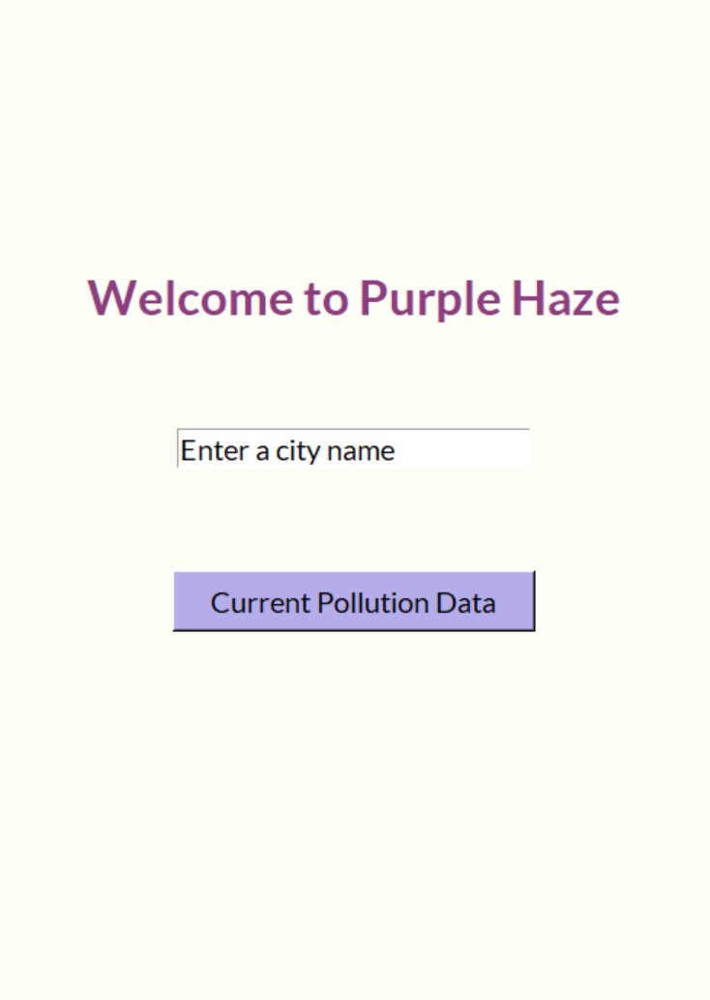
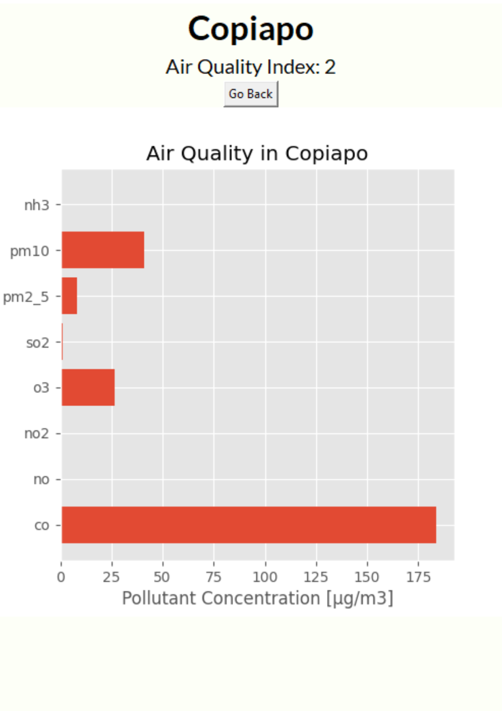
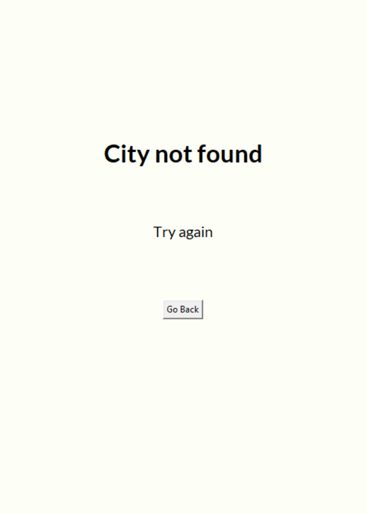

# Purple Haze
Purple Haze is a simple python program destined to visualize the current air pollution using charts.

## Installation

`Python 3 is requiered to run the program`

You can download the files or clone the repository by running:

```
git clone https://github.com/IonelPopJara/purple-haze.git
```

Once you have cloned the folder, in order for you to run the program you need to have the following python libraries installed:

1. MatPlotLib
2. Tkinter
3. dotenv
4. requests

To install the libraries, you can run the following comands through the terminal in your desired python environment:

``` 
pip install python-dotenv
pip install matplotlib
pip install request
pip install tk
```

This software makes use of the [`OpenWeather Air Pollution API`](https://openweathermap.org/api/air-pollution). Therefore, you will need to get an `API Key` before being able to get any data from the app.

You can get a key from the [`OpenWeather`](https://openweathermap.org/api) website.

Once you have the key, you will need to create a `.env` file in the project folder with the following information and put your `key` between the quotes.

```
API_KEY = ""
```

**since `.env` files usually handle personal data they are ommited from the main repository files**

## Usage

Once you have everything set up, you start the program by running the following command:

```
python main.py
```

The main screen will pop up. Here you can enter the name of any city (preferably in English) and search for the current pollution and air quality.

<p align='center'></p>

If the query was succesful, it will show a chart with the current pollution data.

<p align='center'></p>

In case that the city doesn't exit or an error ocurred, the following screen will show.

<p align='center'></p>